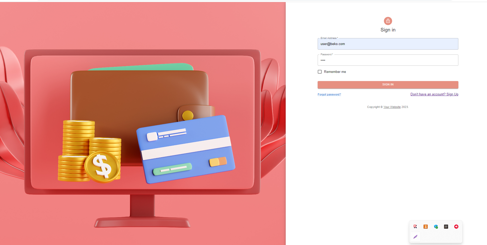
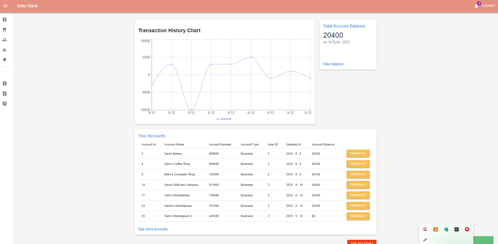
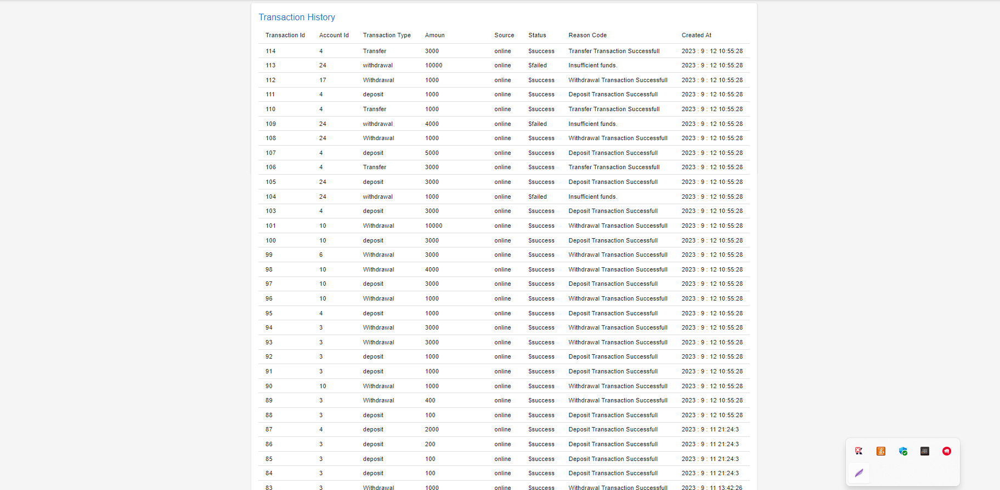
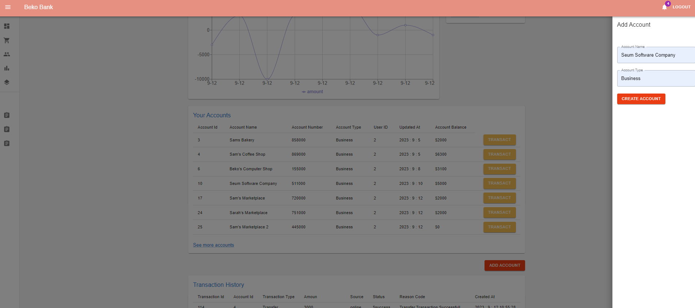
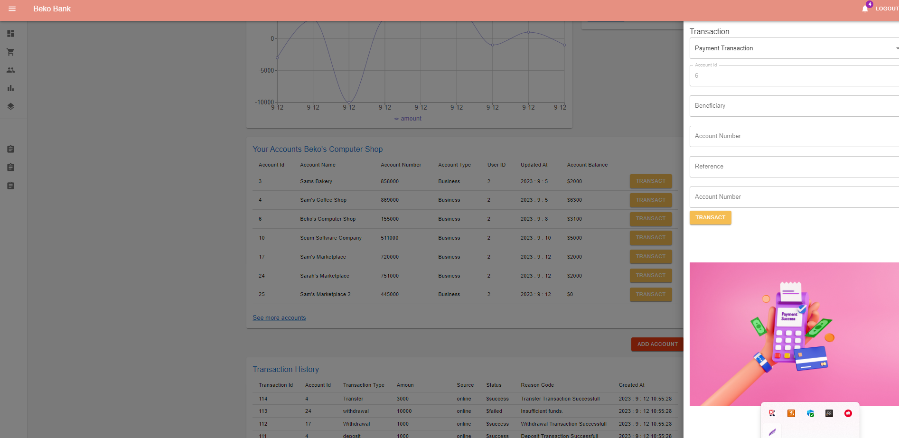

# Online Banking Full Stack Project Frontent Readme File

This is a full-stack project. You can access the backend details of the project from the link below. At this point, we will focus on the frontend.

Java Spring Online Banking Rest Api [Java Spring Rest API]( https://github.com/Berko01/Advanced-Backend-Project-With-Java-Spring-Online-Banking-Rest-Api)


The application is a Frontend project prepared for the Online Banking Rest API. React and Redux are used in the frontend of the application. The project is a single-page application, and I have fully leveraged the benefits provided by Redux. Every component you will see in the project is connected to the Redux Store. When the state of one component changes, all components that need to update their state automatically do so, providing users with real-time information.

Users can register, log in, view their account history, open new accounts, make transfers between accounts, deposit money, withdraw money, and make payments. Additionally, a self-updating chart has been prepared for users to view their account flows. In short, the components are constantly in communication with the backend, ensuring seamless interaction.

If you want to watch the project video you can visit my LinkedIn account:

My LinkedIn Account [LinkedIn]( https://www.linkedin.com/feed/)


If you want to learn more about React and Redux, you can check out my article on React and Redux:

React and Redux Article [My Article]( https://medium.com/@berkindundar2001/react-nedir-ve-react-redux-neden-%C3%B6nemlidir-4c846d7a5124)


Feel free to ask if you have any further questions or need additional information!


## Project Images and Components












  
## Features

- React and Redux
- Single Page Application
- Material UI


  
## Distribution

1- Clone the project to your local machine.
2- Build and run the application using your preferred Java Script environment.

Start for Project

```terminal
  npm install
```

```bash
  npm run start
```

  
## Technologies

**Language:** Java Script 

**Technologies:** - React, Redux, Router Dom
- Redux Thunk
  
## Related projects

You can take a look at the frontends for my React Redux Online Banking App and Android Java Online Banking App projects for this application.

Java Spring Online Banking Rest Api [Java Spring Rest API]( https://github.com/Berko01/Advanced-Backend-Project-With-Java-Spring-Online-Banking-Rest-Api)

Android Online Banking App: [Android Java Online Banking App]( https://github.com/Berko01/Android-Online-Banking-App-With-Java-Spring)


  
## Extracted Lessons

React, Redux, Thunk usage. JavaScript experiences. Communication with backend. CORS Policy Setting. MUI usage. Frontend web development. JWT and cookies.
  
## Programmers

- [@Berko01](https://github.com/Berko01) design and development.

  
